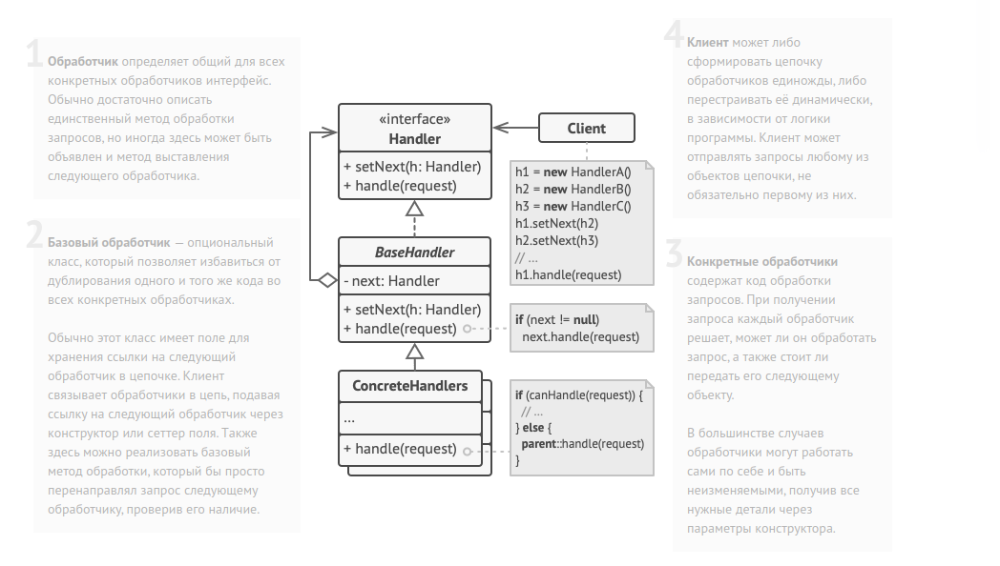

Chain of Responsibility method diagram:

Интерфейс обработчиков.
interface ComponentWithContextualHelp is
    method showHelp()

Базовый класс простых компонентов.
abstract class Component implements ComponentWithContextualHelp is
    field tooltipText: string

    Контейнер, содержащий компонент, служит в качестве
    следующего звена цепочки.
    protected field container: Container

    Базовое поведение компонента заключается в том, чтобы
    показать всплывающую подсказку, если для неё задан текст.
    В обратном случае — перенаправить запрос своему
    контейнеру, если тот существует.
    method showHelp() is
        if (tooltipText != null)
            // Показать подсказку.
        else
            container.showHelp()    

Контейнеры могут включать в себя как простые компоненты, так
и другие контейнеры. Здесь формируются связи цепочки. Класс
контейнера унаследует метод showHelp от своего родителя —
базового компонента.
abstract class Container extends Component is
    protected field children: array of Component

    method add(child) is
        children.add(child)
        child.container = this           

Большинство примитивных компонентов устроит базовое поведение
показа помощи через подсказку, которое они унаследуют из
класса Component.
class Button extends Component is
    // ...

Но сложные компоненты могут переопределять метод показа
помощи по-своему. Но и в этом случае они всегда могут
вернуться к базовой реализации, вызвав метод родителя.
class Panel extends Container is
    field modalHelpText: string

    method showHelp() is
        if (modalHelpText != null)
            // Показать модальное окно с помощью.
        else    
          super.showHelp()

...то же, что и выше...
class Dialog extends Container is
    field wikiPageURL: string

    method showHelp() is
        if (wikiPageURL != null)
            // Открыть страницу Wiki в браузере.
        else
            super.showHelp()        

Клиентский код.
class Application is
    // Каждое приложение конфигурирует цепочку по-своему.
    method createUI() is
        dialog = new Dialog("Budget Reports")
        dialog.wikiPageURL = "http://..."
        panel = new Panel(0, 0, 400, 800)
        panel.modalHelpText = "This panel does..."
        ok = new Button(250, 760, 50, 20, "OK")
        ok.tooltipText = "This is an OK button that..."
        cancel = new Button(320, 760, 50, 20, "Cancel")
        // ...
        panel.add(ok)
        panel.add(cancel)
        dialog.add(panel)

    // Представьте, что здесь произойдёт.
    method onF1KeyPress() is
        component = this.getComponentAtMouseCoords()
        component.showHelp()