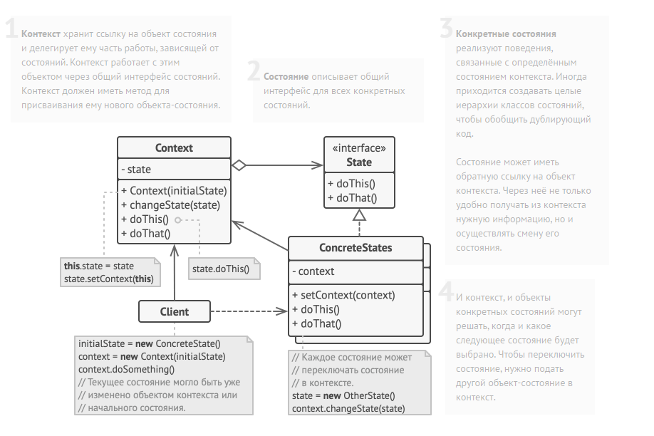

State method diagram:

// Общий интерфейс всех состояний.
abstract class State is
    protected field player: AudioPlayer

    // Контекст передаёт себя в конструктор состояния, чтобы
    // состояние могло обращаться к его данным и методам в
    // будущем, если потребуется.
    constructor State(player) is
        this.player = player

    abstract method clickLock()
    abstract method clickPlay()
    abstract method clickNext()
    abstract method clickPrevious()

// Конкретные состояния реализуют методы абстрактного состояния
// по-своему.
class LockedState extends State is

    // При разблокировке проигрователя с заблокированными
    // клавишами он может принять одно из двух состояний.
    method clickLock() is
        if (player.playing)
            player.changeState(new PlayingState(player))
        else
            player.changeState(new ReadyState(player))

    method clickPlay() is
        // Ничего не делать.

    method clickNext() is
        // Ничего не делать.

    method clickPrevious() is
        // Ничего не делать.    

// Конкретные состояния сами могут переводить контекст в другое
// состояние.        
class ReadyState extends State is
    method clickLock() is
        player.changeState(new LockedState(player))

    method clickPlay() is
        player.startPlayback()
        player.changeState(new PlayingState(player))

    method clickNext() is
        player.nextSong()

    method clickPrevious() is
        player.previousSong()

class PlayingState extends State is
    method clickLock() is
        player.changeState(new LockedState(player))

    method clickPlay() is
        player.stopPlayback()
        player.changeState(new ReadyState(player))

    method clickNext() is
        if (event.doubleclick)
            player.nextSong()
        else
            player.fastForward(5)

    method clickPrevious() is
        if (event.doubleclick)
            player.previous()
        else
            player.rewind(5)        

// Проигрыватель выступает в роли контекста.
class AudioPlayer is
    field state: State
    field UI, volume, playlist, currentSong

    constructor AudioPlayer() is
        this.state = new ReadyState(this)

        // Контекст заставляет состояние реагировать на
        // пользовательский ввод вместо себя. Реакция может быть
        // разной, в зависимости от того, какое состояние сейчас
        // активно.
        UI = new UserInterface()
        UI.lockButton.onClick(this.clickLock)
        UI.playButton.onClick(this.clickPlay)
        UI.nextButton.onClick(this.clickNext)
        UI.prevButton.onClick(this.clickPrevious)

    // Другие объекты тоже должны иметь возможность заменять
    // состояние проигрывателя.
    method changeState(state: State) is
        this.state = state

    // Методы UI будут делегировать работу активному состоянию.
    method clickLock() is
        state.clickLock()
    method clickPlay() is
        state.clickPlay()
    method clickNext() is
        state.clickNext()
    method clickPrevious() is
        state.clickPrevious()

    // Сервисные методы контекста, вызываемые состояниями.
    method startPlayback() is
        // ...
    method stopPlayback() is
        // ...
    method nextSong() is
        // ...
    method previousSong() is
        // ...
    method fastForward(time) is
        // ...
    method rewind(time) is
        // ...            