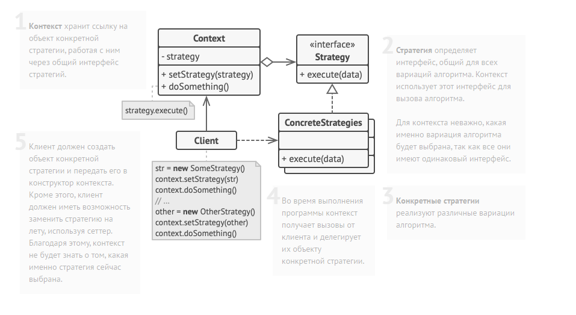

Strategy method diagram:

// Общий интерфейс всех стратегий.
interface Strategy is
    method execute(a, b)

// Каждая конкретная стратегия реализует общий интерфейс своим
// способом.
class ConcreteStrategyAdd implements Strategy is
    method execute(a, b) is
        return a + b

class ConcreteStrategySubtract implements Strategy is
    method execute(a, b) is
        return a - b

class ConcreteStrategyMultiply implements Strategy is
    method execute(a, b) is
        return a * b

// Контекст всегда работает со стратегиями через общий
// интерфейс. Он не знает, какая именно стратегия ему подана.
class Context is
    private strategy: Strategy

    method setStrategy(Strategy strategy) is
        this.strategy = strategy

    method executeStrategy(int a, int b) is
        return strategy.execute(a, b)

// Конкретная стратегия выбирается на более высоком уровне,
// например, конфигуратором всего приложения. Готовый объект-
// стратегия подаётся в клиентский объект, а затем может быть
// заменён другой стратегией в любой момент на лету.
class ExampleApplication is
    method main() is
        // 1. Создать объект контекста.
        // 2. Получить первое число (n1).
        // 3. Получить второе число (n2).
        // 4. Получить желаемую операцию.
        // 5. Затем, выбрать стратегию:

        if (action == addition) then
            context.setStrategy(new ConcreteStrategyAdd())

        if (action == subtraction) then
            context.setStrategy(new ConcreteStrategySubtract())

        if (action == multiplication) then
            context.setStrategy(new ConcreteStrategyMultiply())

        // 6. Выполнить операцию с помощью стратегии:
        result = context.executeStrategy(n1, n2)

        // 7. Вывести результат на экран.