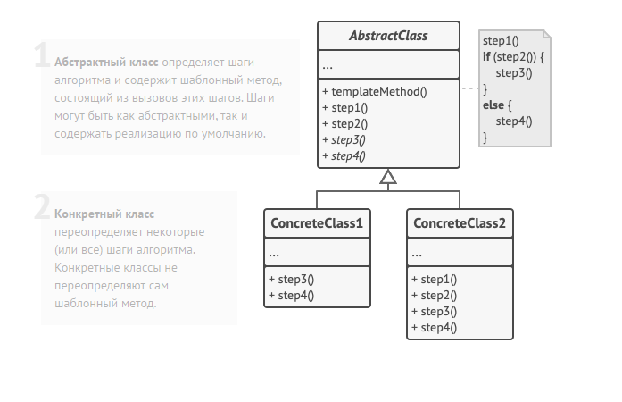

Template method diagram:

class GameAI is
    // Шаблонный метод должен быть задан в базовом классе. Он
    // состоит из вызовов методов в определённом порядке. Чаще
    // всего эти методы являются шагами некоего алгоритма.
    method turn() is
        collectResources()
        buildStructures()
        buildUnits()
        attack()

    // Некоторые из этих методов могут быть реализованы прямо в
    // базовом классе.
    method collectResources() is
        foreach (s in this.builtStructures) do
            s.collect()

    // А некоторые могут быть полностью абстрактными.
    abstract method buildStructures()
    abstract method buildUnits()

    // Кстати, шаблонных методов в классе может быть несколько.
    method attack() is
        enemy = closestEnemy()
        if (enemy == null)
            sendScouts(map.center)
        else
            sendWarriors(enemy.position)

    abstract method sendScouts(position)
    abstract method sendWarriors(position)

// Подклассы могут предоставлять свою реализацию шагов
// алгоритма, не изменяя сам шаблонный метод.
class OrcsAI extends GameAI is
    method buildStructures() is
        if (there are some resources) then
            // Строить фермы, затем бараки, а потом цитадель.

    method buildUnits() is
        if (there are plenty of resources) then
            if (there are no scouts)
                // Построить раба и добавить в группу
                // разведчиков.
            else
                // Построить пехотинца и добавить в группу
                // воинов.

    // ...

    method sendScouts(position) is
        if (scouts.length > 0) then
            // Отправить разведчиков на позицию.

    method sendWarriors(position) is
        if (warriors.length > 5) then
            // Отправить воинов на позицию.

// Подклассы могут не только реализовывать абстрактные шаги, но
// и переопределять шаги, уже реализованные в базовом классе.
class MonstersAI extends GameAI is
    method collectResources() is
        // Ничего не делать.

    method buildStructures() is
        // Ничего не делать.

    method buildUnits() is
        // Ничего не делать.