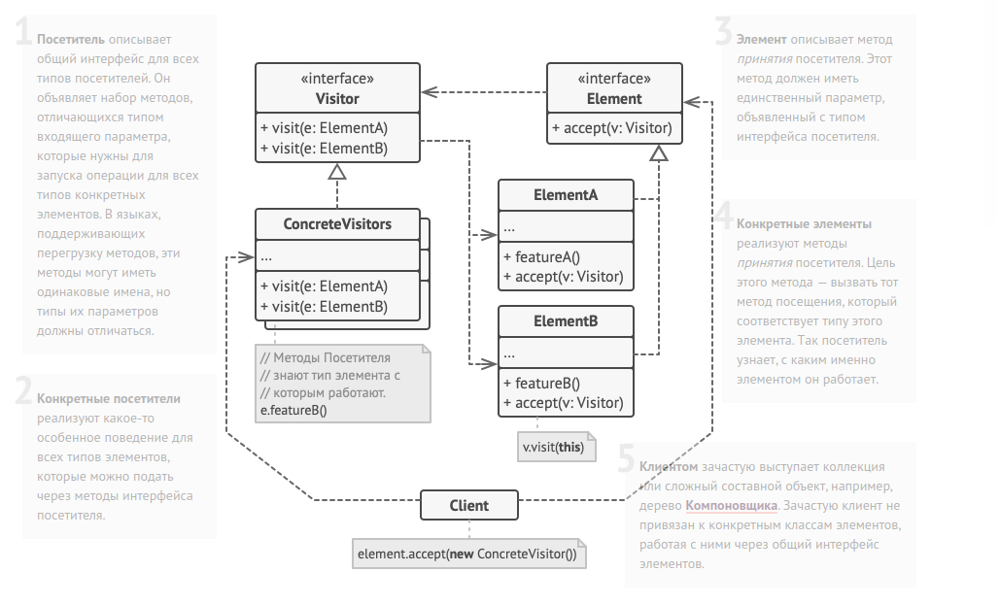

Visitor method diagram:

// Сложная иерархия элементов.
interface Shape is
    method move(x, y)
    method draw()
    method accept(v: Visitor)

// Метод принятия посетителя должен быть реализован в каждом
// элементе, а не только в базовом классе. Это поможет программе
// определить, какой метод посетителя нужно вызвать, если вы не
// знаете тип элемента.
class Dot implements Shape is
    // ...
    method accept(v: Visitor) is
        v.visitDot(this)

class Circle implements Shape is
    // ...
    method accept(v: Visitor) is
        v.visitCircle(this)

class Rectangle implements Shape is
    // ...
    method accept(v: Visitor) is
        v.visitRectangle(this)

class CompoundShape implements Shape is
    // ...
    method accept(v: Visitor) is
        v.visitCompoundShape(this)    

// Интерфейс посетителей должен содержать методы посещения
// каждого элемента. Важно, чтобы иерархия элементов менялась
// редко, так как при добавлении нового элемента придётся менять
// всех существующих посетителей.
interface Visitor is
    method visitDot(d: Dot)
    method visitCircle(c: Circle)
    method visitRectangle(r: Rectangle)
    method visitCompoundShape(cs: CompoundShape)        

// Конкретный посетитель реализует одну операцию для всей
// иерархии элементов. Новая операция = новый посетитель.
// Посетитель выгодно применять, когда новые элементы
// добавляются очень редко, а новые операции — часто.
class XMLExportVisitor implements Visitor is
    method visitDot(d: Dot) is
        // Экспорт id и координат центра точки.

    method visitCircle(c: Circle) is
        // Экспорт id, кординат центра и радиуса окружности.

    method visitRectangle(r: Rectangle) is
        // Экспорт id, кординат левого-верхнего угла, ширины и
        // высоты прямоугольника.

    method visitCompoundShape(cs: CompoundShape) is
        // Экспорт id составной фигуры, а также списка id
        // подфигур, из которых она состоит.    

// Приложение может применять посетителя к любому набору
// объектов элементов, даже не уточняя их типы. Нужный метод
// посетителя будет выбран благодаря проходу через метод accept.
class Application is
    field allShapes: array of Shapes

    method export() is
        exportVisitor = new XMLExportVisitor()

        foreach (shape in allShapes) do
            shape.accept(exportVisitor)        