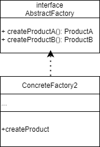

 

Этот паттерн предполагает, что у вас есть несколько семейств продуктов, находящихся в отдельных иерархиях классов
(Button/Checkbox). Продукты одного семейства должны иметь
общий интерфейс.

interface Button is 
  method paint()

Семейства продуктов имеют те же вариации (macOS/Windows).

class WinButton implements Button is
    method paint() is
         Отрисовать кнопку в стиле Windows.

class MacButton implements Button is
    method paint() is
         Отрисовать кнопку в стиле macOS.  

interface Checkbox is
    method paint()

class WinCheckbox implements Checkbox is
    method paint() is
         Отрисовать чекбокс в стиле Windows.

class MacCheckbox implements Checkbox is
    method paint() is
         Отрисовать чекбокс в стиле macOS.

Абстрактная фабрика знает обо всех абстрактных типах продуктов.
interface GUIFactory is
    method createButton():Button
    method createCheckbox():Checkbox

Каждая конкретная фабрика знает и создаёт только продукты
своей вариации.
class WinFactory implements GUIFactory is
    method createButton():Button is
        return new WinButton()
    method createCheckbox():Checkbox is
        return new WinCheckbox()

Несмотря на то, что фабрики оперируют конкретными классами,
их методы возвращают абстрактные типы продуктов. Благодаря
этому фабрики можно взаимозаменять, не изменяя клиентский
код.
class MacFactory implements GUIFactory is
    method createButton():Button is
        return new MacButton()
    method createCheckbox():Checkbox is
        return new MacCheckbox()

Для кода, использующего фабрику, не важно, с какой конкретно
фабрикой он работает. Все получатели продуктов работают с
ними через общие интерфейсы.
class Application is
    private field factory: GUIFactory
    private field button: Button
    constructor Application(factory: GUIFactory) is
        this.factory = factory
    method createUI()
        this.button = factory.createButton()
    method paint()
        button.paint()

Приложение выбирает тип конкретной фабрики и создаёт её
динамически, исходя из конфигурации или окружения.
class ApplicationConfigurator is
    method main() is
        config = readApplicationConfigFile()

        if (config.OS == "Windows") then
            factory = new WinFactory()
        else if (config.OS == "Mac") then
            factory = new MacFactory()
        else
            throw new Exception("Error! Unknown operating system.")

        Application app = new Application(factory)        
