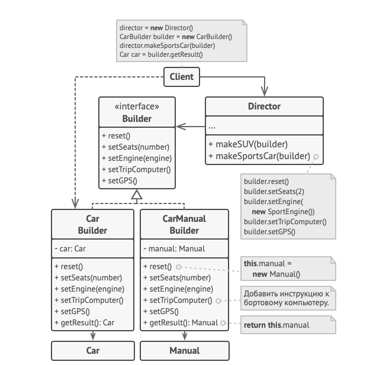
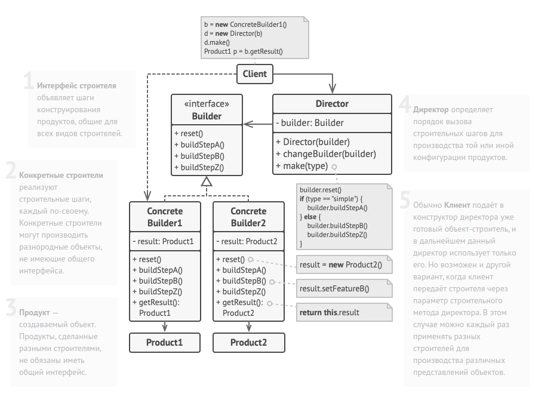

Builder method diagram car example:

Строитель может создавать различные продукты, используя один
и тот же процесс строительства.

class Car is
  Автомобили могут отличаться комплектацией: типом
  двигателя, количеством сидений, могут иметь или не иметь
  GPS и систему навигации и т. д. Кроме того, автомобили
  могут быть городскими, спортивными или внедорожниками.

class Manual is
  Руководство пользователя для данной конфигурации
  автомобиля.

Интерфейс строителя объявляет все возможные этапы и шаги
конфигурации продукта.  
interface Builder is
    method reset()
    method setSeats(...)
    method setEngine(...)
    method setTripComputer(...)
    method setGPS(...)

Все конкретные строители реализуют общий интерфейс по-своему.

class CarBuilder implements Builder is
    private field car:Car
    method reset()
        Поместить новый объект Car в поле "car".
    method setSeats(...) is
        Установить указанное количество сидений.
    method setEngine(...) is
        Установить поданный двигатель.
    method setTripComputer(...) is
        Установить поданную систему навигации.
    method setGPS(...) is
        Установить или снять GPS.
    method getResult():Car is
        Вернуть текущий объект автомобиля

В отличие от других порождающих паттернов, где продукты
должны быть частью одной иерархии классов или следовать
общему интерфейсу, строители могут создавать совершенно
разные продукты, которые не имеют общего предка.        

class CarManualBuilder implements Builder is
    private field manual:Manual
    method reset()
        Поместить новый объект Manual в поле "manual".
    method setSeats(...) is
        Описать, сколько мест в машине.
    method setEngine(...) is
        Добавить в руководство описание двигателя.
    method setTripComputer(...) is
        Добавить в руководство описание системы навигации.
    method setGPS(...) is
        Добавить в инструкцию инструкцию GPS.
    method getResult():Manual is
        Вернуть текущий объект руководства.

Директор знает, в какой последовательности нужно заставлять
работать строителя, чтобы получить ту или иную версию
продукта. Заметьте, что директор работает со строителем через
общий интерфейс, благодаря чему он не знает тип продукта,
который изготовляет строитель.

class Director is
    method constructSportsCar(builder: Builder) is
        builder.reset()
        builder.setSeats(2)
        builder.setEngine(new SportEngine())
        builder.setTripComputer(true)
        builder.setGPS(true)

Директор получает объект конкретного строителя от клиента
(приложения). Приложение само знает, какого строителя нужно
использовать, чтобы получить определённый продукт.

class Application is
    method makeCar() is
        director = new Director()

        CarBuilder builder = new CarBuilder()
        director.constructSportsCar(builder)
        Car car = builder.getResult()

        CarManualBuilder builder = new CarManualBuilder()
        director.constructSportsCar(builder)

        Готовый продукт возвращает строитель, так как
        директор чаще всего не знает и не зависит от
        конкретных классов строителей и продуктов.
        Manual manual = builder.getResult()

Builder method diagram structure:
        