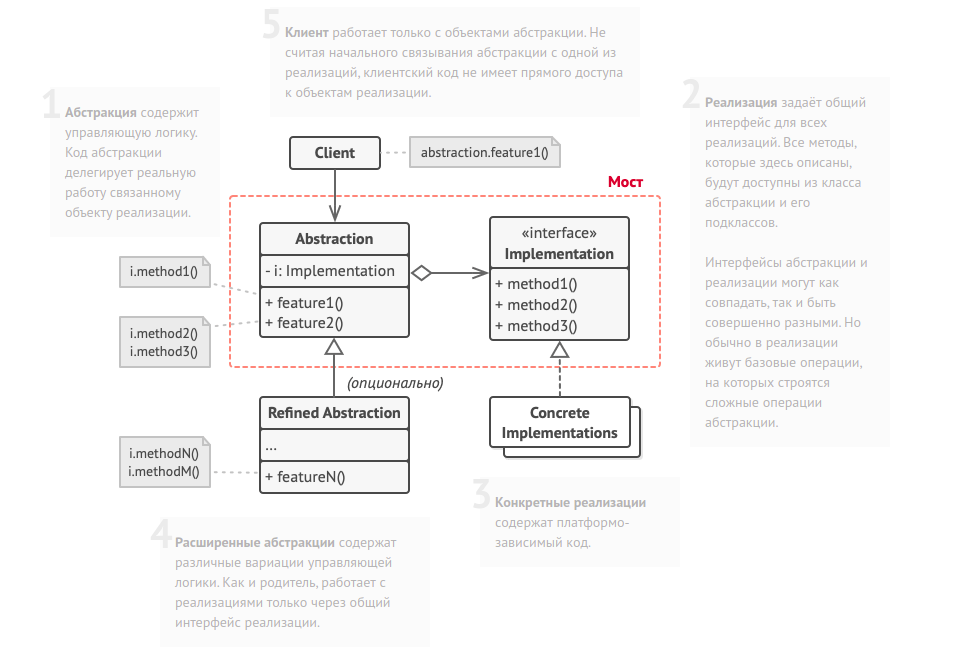

Bridge method diagram:

Класс пультов имеет ссылку на устройство, которым управляет.
Методы этого класса делегируют работу методам связанного
устройства.

class Remote is
    protected field device: Device
    constructor Remote(device: Device) is
        this.device = device

  method togglePower() is
        if (device.isEnabled()) then
            device.disable()
        else
            device.enable()    

  method volumeDown() is
        device.setVolume(device.getVolume() - 10)
    method volumeUp() is
        device.setVolume(device.getVolume() + 10)
    method channelDown() is
        device.setChannel(device.getChannel() - 1)
    method channelUp() is
        device.setChannel(device.getChannel() + 1)

Вы можете расширять класс пультов, не трогая код устройств.

class AdvancedRemote extends Remote is
    method mute() is
        device.setVolume(0)

Все устройства имеют общий интерфейс. Поэтому с ними может
работать любой пульт.        

interface Device is
    method isEnabled()
    method enable()
    method disable()
    method getVolume()
    method setVolume(percent)
    method getChannel()
    method setChannel(channel)

Но каждое устройство имеет особую реализацию.
class Tv implements Device is
    // ...

class Radio implements Device is
    // ...    

Где-то в клиентском коде.
tv = new Tv()
remote = new Remote(tv)
remote.togglePower()

radio = new Radio()
remote = new AdvancedRemote(radio)
  