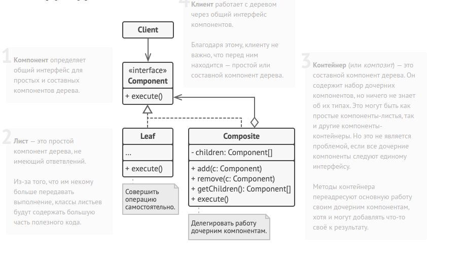

Composite method diagram:

Общий интерфейс компонентов.
interface Graphic is
    method move(x, y)
    method draw()

Простой компонент.

class Dot implements Graphic is
    field x, y

    constructor Dot(x, y) { ... }

    method move(x, y) is
        this.x += x, this.y += y

    method draw() is
        // Нарисовать точку в координате X, Y.

Компоненты могут расширять другие компоненты.
class Circle extends Dot is
    field radius

    constructor Circle(x, y, radius) { ... }

    method draw() is
        // Нарисовать окружность в координате X, Y и радиусом R.

Контейнер содержит операции добавления/удаления дочерних
компонентов. Все стандартные операции интерфейса компонентов
он делегирует каждому из дочерних компонентов.

class CompoundGraphic implements Graphic is
    field children: array of Graphic

    method add(child: Graphic) is
        // Добавить компонент в список дочерних.

    method remove(child: Graphic) is
        // Убрать компонент из списка дочерних.

    method move(x, y) is
        foreach (child in children) do
            child.move(x, y)

    method draw() is
        // 1. Для каждого дочернего компонента:
        //     - Отрисовать компонент.
        //     - Определить координаты максимальной границы.
        // 2. Нарисовать пунктирную границу вокруг всей области.

Приложение работает единообразно как с единичными
компонентами, так и с целыми группами компонентов.

class ImageEditor is
    field all: CompoundGraphic

    method load() is
        all = new CompoundGraphic()
        all.add(new Dot(1, 2))
        all.add(new Circle(5, 3, 10))
        // ...

Группировка выбранных компонентов в один сложный компонент
     method groupSelected(components: array of Graphic) is
        group = new CompoundGraphic()
        foreach (component in components) do
            group.add(component)
            all.remove(component)
        all.add(group)
        // Все компоненты будут отрисованы.
        all.draw()      