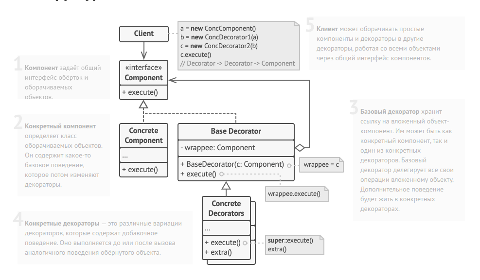

Decorator method diagram:

Общий интерфейс компонентов.
interface DataSource is
    method writeData(data)
    method readData():data

Один из конкретных компонентов реализует базовую функциональность. 
class FileDataSource implements DataSource is
    constructor FileDataSource(filename) { ... }

    method writeData(data) is
        // Записать данные в файл.

    method readData():data is
        // Прочитать данные из файла.

Родитель всех декораторов содержит код обёртывания
class DataSourceDecorator implements DataSource is
    protected field wrappee: DataSource

  constructor DataSourceDecorator(source: DataSource) is
        wrappee = source

    method writeData(data) is
        wrappee.writeData(data)

    method readData():data is
        return wrappee.readData()      

Конкретные декораторы добавляют что-то своё к базовому
поведению обёрнутого компонента.     

class EncryptionDecorator extends DataSourceDecorator is
    method writeData(data) is
        // 1. Зашифровать поданные данные.
        // 2. Передать зашифрованные данные в метод writeData
        // обёрнутого объекта (wrappee).

    method readData():data is
        // 1. Получить данные из метода readData обёрнутого
        // объекта (wrappee).
        // 2. Расшифровать их, если они зашифрованы.
        // 3. Вернуть результат.

Декорировать можно не только базовые компоненты, но и уже обёрнутые объекты.

class CompressionDecorator extends DataSourceDecorator is
    method writeData(data) is
        // 1. Запаковать поданные данные.
        // 2. Передать запакованные данные в метод writeData
        // обёрнутого объекта (wrappee).

    method readData():data is
        // 1. Получить данные из метода readData обёрнутого
        // объекта (wrappee).
        // 2. Распаковать их, если они запакованы.
        // 3. Вернуть результат.

Вариант 1. Простой пример сборки и использования декораторов.

class Application is
  method dumbUsageExample() is
        source = new FileDataSource("somefile.dat")
        source.writeData(salaryRecords)
        // В файл были записаны чистые данные.

        source = new CompressionDecorator(source)
        source.writeData(salaryRecords)
        // В файл были записаны сжатые данные.

        source = new EncryptionDecorator(source)
        // Сейчас в source находится связка из трёх объектов:
        // Encryption > Compression > FileDataSource

        source.writeData(salaryRecords)
        // В файл были записаны сжатые и зашифрованные данные.

Вариант 2. Клиентский код, использующий внешний источник
данных. Класс SalaryManager ничего не знает о том, как именно
будут считаны и записаны данные. Он получает уже готовый
источник данных.

class SalaryManager is
    field source: DataSource

    constructor SalaryManager(source: DataSource) { ... }

    method load() is
        return source.readData()

    method save() is
        source.writeData(salaryRecords)
    // ...Остальные полезные методы...

Приложение может по-разному собирать декорируемые объекты, в
зависимости от условий использования.
class ApplicationConfigurator is
    method configurationExample() is
        source = new FileDataSource("salary.dat")
        if (enabledEncryption)
            source = new EncryptionDecorator(source)
        if (enabledCompression)
            source = new CompressionDecorator(source)

        logger = new SalaryManager(source)
        salary = logger.load()
    // ...
