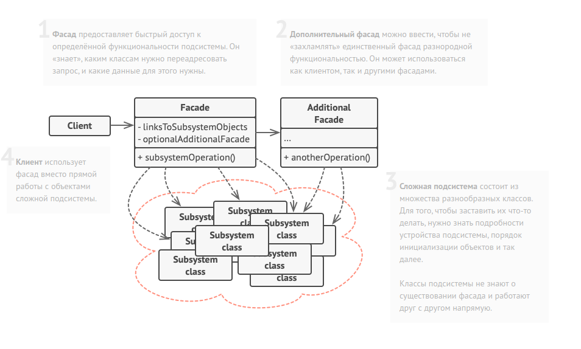

Facade method diagram:

Классы сложного стороннего фреймворка конвертации видео. Мы
не контролируем этот код, поэтому не можем его упростить.

class VideoFile
// ...

class OggCompressionCodec
// ...

class MPEG4CompressionCodec
// ...

class CodecFactory
// ...

class BitrateReader
// ...

class AudioMixer
// ...

Вместо этого мы создаём Фасад — простой интерфейс для работы
со сложным фреймворком. Фасад не имеет всей функциональности
фреймворка, но зато скрывает его сложность от клиентов.

class VideoConverter is
  method convert(filename, format):File is
   file = new VideoFile(filename)
   sourceCodec = new CodecFactory.extract(file)
   f (format == "mp4")
          destinationCodec = new MPEG4CompressionCodec()
       else
          destinationCodec = new OggCompressionCodec()
       buffer = BitrateReader.read(filename, sourceCodec)
       result = BitrateReader.convert(buffer, destinationCodec)
       result = (new AudioMixer()).fix(result)
       return new File(result)

Приложение не зависит от сложного фреймворка конвертации
видео. Кстати, если вы вдруг решите сменить фреймворк, вам
нужно будет переписать только класс фасада.   

class Application is
    method main() is
        convertor = new VideoConverter()
        mp4 = convertor.convert("funny-cats-video.ogg", "mp4")
        mp4.save()