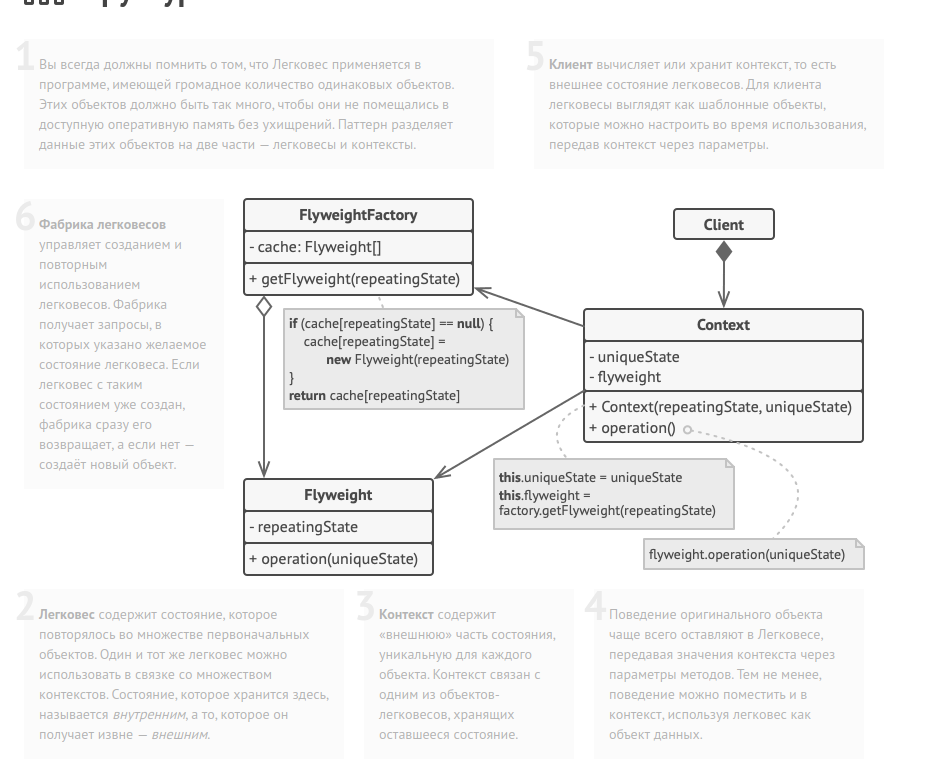

Flyweight method diagram:

Этот класс-легковес содержит часть полей, которые описывают
деревья. Эти поля не уникальны для каждого дерева, в отличие,
например, от координат: несколько деревьев могут иметь ту же
текстуру.

Поэтому мы переносим повторяющиеся данные в один-единственный
объект и ссылаемся на него из множества отдельных деревьев.

class TreeType is
    field name
    field color
    field texture
    constructor TreeType(name, color, texture) { ... }
    method draw(canvas, x, y) is
        // 1. Создать картинку данного типа, цвета и текстуры.
        // 2. Нарисовать картинку на холсте в позиции X, Y.

Фабрика легковесов решает, когда нужно создать новый
легковес, а когда можно обойтись существующим.

class TreeFactory is
    static field treeTypes: collection of tree types
    static method getTreeType(name, color, texture) is
        type = treeTypes.find(name, color, texture)
        if (type == null)
            type = new TreeType(name, color, texture)
            treeTypes.add(type)
        return type

Контекстный объект, из которого мы выделили легковес
TreeType. В программе могут быть тысячи объектов Tree, так
как накладные расходы на их хранение совсем небольшие — в
памяти нужно держать всего три целых числа (две координаты и
ссылка).

class Tree is
    field x,y
    field type: TreeType
    constructor Tree(x, y, type) { ... }
    method draw(canvas) is
        type.draw(canvas, this.x, this.y)

Классы Tree и Forest являются клиентами Легковеса. При
желании их можно слить в один класс, если вам не нужно
расширять класс деревьев далее.

class Forest is
    field trees: collection of Trees

    method plantTree(x, y, name, color, texture) is
        type = TreeFactory.getTreeType(name, color, texture)
        tree = new Tree(x, y, type)
        trees.add(tree)

    method draw(canvas) is
        foreach (tree in trees) do
            tree.draw(canvas)